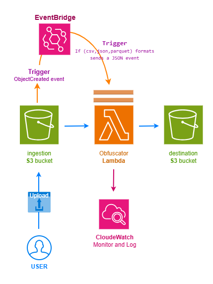

# Launchpad GDPR Obfuscator Library and Service
The GDPR Obfuscator is a general-purpose Python library and cloud-native service designed to intercept and anonymize personally identifiable information (PII) during data ingestion into the AWS ecosystem. It ensures that data stored for bulk analysis is GDPR-compliant by masking sensitive fields with ['***'] while maintaining file integrity and schema.

This project provides both the core Python library and a production-ready AWS deployment (via Terraform) for event-driven obfuscation.

### Key features:

* **Modular Architecture:** The core logic is decoupled into a standalone AWS Lambda Layer, allowing the obfuscator to be imported as a library by any other Python service within the AWS account.
* **Multi-Format Support:** Handles CSV, JSON, and Parquet files.
* **Pseudonymization:** Replaces sensitive data (e.g., names, emails) with masked strings ('***') while preserving the original file structure.
* **Zero Local Persistence:** Implemented using a memory-efficient Byte Stream approach; data is processed in-RAM and streamed directly to S3 to ensure no sensitive data is persisted in temporary Lambda storage.
* **Event-Driven:** Automatically triggers via Amazon EventBridge when new files are uploaded.
* **High Performance:** Process files up to 1MB in under 60 seconds to ensure efficient data pipelines.
* **Infrastructure as Code:** Fully automated deployment using CI/CD Github Action and Terraform to ensure a reproducible environment within the AWS ecosystem.

### How it Works:
The service follows the "Anonymization at Ingestion" pattern:

* **Ingestion:** A file lands in the `gdpr-ingestion-bucket-[randomNumber]` S3 bucket
* **Trigger:** EventBridge captures an *ObjectCreated* event, filters for supported extensions (.csv, .json, .parquet), and invokes the Lambda function, sends a JSON event.
* **Processing:** The Lambda function reads the file into a memory-efficient Pandas DataFrame using awswrangler. It identifies PII columns defined in the configuration (json event). 
* **Obfuscation:** The tool identifies (Pii) columns specified in the configuration and replaces sensitive values with a fixed mask while maintaining the original data structure and file schema. The resulting stream is saved to the destination S3 bucket, ensuring no sensitive data is persisted in temporary Lambda storage.
* **Output:** The resulting byte stream is saved to the `gdpr-obfuscated-bucket-[randomNumber]`
* **Audit:** All actions monitored and potential errors are logged to AWS CloudWatch: All processing logs, including success metrics and error traces, are available in the /aws/lambda/gdpr_obfuscator log group. Error Handling: If an unsupported file type or corrupted file is uploaded, the service logs a descriptive error message without crashing the pipeline.

The awswrangler (AWS SDK for Pandas) library was integrated to provide memory-efficient, high-level data processing and seamless S3 to DataFrame streaming, and by utilizing the AWS managed ARN layer, I maintain a lightweight Lambda package while gaining robust support for complex CSV, JSON, and Parquet schema handling.

### The obfuscator tool will be invoked by sending a JSON string:<br>

JSON string containing:
* the S3 location of the required CSV file for obfuscation
* the names of the fields that are required to be obfuscated 

// Example EventBridge Trigger Payload (JSON)
```bash
{
  "file_to_obfuscate": "s3://my_ingestion_bucket/new_data/file1.csv",
  "pii_fields": ["name", "email_address"]
}
```

### Customizing Obfuscation
You can define which fields to hide without changing the Python code through the alternative set up form. Edit the terraform/terraform.tfvars file.<br>
Please, see example_terraform.tfvars:<br>
```bash
region             = "your-aws-region"
pii_fields         = ["name", "email_address", "phone_number"] - etc.
primary_key        = "student_id"  # <--- This is optional.
```

## AWS Architecture Diagram



### Project Compliance & Quality

* **GDPR Requirement:** All (PII) data that could identify an individual must be pseudonymized (masked). [***]
* **Data Integrity:** Output files maintain the exact structure of the input, replacing only specified PII fields.
* **Security:** Codebase audited for vulnerabilities; zero hardcoded credentials.
* **PEP-8:** 100% compliance via Flake8
* **Scalability:** Tested for files up to 1MB; Runtime < 60s.
* **Dynamic Configuration:** Uses terraform.tfvars to allow users to customize bucket names, environment tags, and PII field lists without changing the core code.

## Technologies and packages

<p align="center">
    <!-- Python -->
    <a href="https://www.python.org/" target="_blank" rel="noreferrer" style="margin: 25px;">
        
    </a>
    <!-- Terraform -->
    <a href="https://www.terraform.io/" target="_blank" rel="noreferrer" style="margin: 25px;">
        
    </a>
    <!-- Amazon -->
    <a href="https://aws.amazon.com/" target="_blank" rel="noreferrer" style="margin: 25px;">
        
    </a>
    <!-- Github Action -->
    <a href="https://github.com/features/actions" target="_blank" rel="noreferrer" style="margin: 25px;">
        
    </a>
    <!-- Git -->
    <a href="https://git-scm.com/" target="_blank" rel="noreferrer" style="margin: 25px;">
        
    </a>
</p>

<!-- Python packages list -->
### Python packages:
<ul>
    <li>boto3</li>
    <li>awswrangler</li>
    <li>pandas</li>
    <li>pytest</li>
    <li>moto</li>
    <li>bandit</li>
    <li>pip-audit</li>
    <li>black</li>
    <li>flake8</li>
</ul>

## Installation & Setup (Local)

1. Clone the Repository<br>

```bash
git clone https://github.com/Leda909/GDPR_Obfuscator
cd GDPR_Obfuscator
```

2. Environment Setup<br>

### On Windows:
Please, see detailed guide in *assets/windows.md* file.

### On Linux | MacOs
IMPORTANT! Github CI/CD runs in Linux, hence you can use the makefile made for Linux system.

* Create a virtual environment:<br>
`python -m venv venv`

* Activate your venv:<br>
`source venv/bin/activate`

* Install packages: 
Required packages are listed in requirements.txt and can be installed using the makefile.<br>
`make requirements`

3. Set up your **AWS CREDENTIALS**

To use AWS services and infrastructure, sign up to a AWS account and create a IAM user. Once this is done, extract your AWS_ACCESS_KEY_ID and AWS_SECRET_ACCESS_KEY.

Run the following in your VS terminal:

```bash
export AWS_ACCESS_KEY_ID = <your key id>
export AWS_SECRET_ACCESS_KEY = <your secret access key>
export AWS_DEFAULT_REGION = <your default region>
```

4. Create Remote S3 Backend bucket for terraform.state files (One-time Bootstrap)<br>

Create S3 backend bucket terraform.state file to allow for team collaboration and CI/CD:

`aws s3api create-bucket --bucket s3-obfuscator-terraform-state --region eu-west-2 --create-bucket-configuration LocationConstraint=eu-west-2`

```bash
{
"Location": "http://s3-obfuscator-terraform-state.s3.amazonaws.com/"
}
```

Enable Versioning on it (Recommended). Run in terminal:
`aws s3api put-bucket-versioning --bucket s3-obfuscator-terraform-state --versioning-configuration Status=Enabled`

5. Deploy Infrastructure by Terraform<br>
(Run the following commands step by step in the terminal):

* `cd terraform`

* `terraform init`

* `terraform validate`  <-- This is a basic terraform structure checker. /optional/

* `terraform fmt`  <-- This is format checker for terraform.  /optional/

* `terraform plan`

* `terraform apply`

6. You can check whether S3 buckets are created: `aws s3 ls`

## Remote Installation

1. Simply fork this repo and Configure your AWS credentials in **GitHub Secrets**.

2. Create a backend S3 bucket for state files

3. Navigate to your repository **Settings > Secrets and variables > Actions**.

Add the following New repository secrets:

```bash
AWS_ACCESS_KEY_ID: Your AWS access key.
AWS_SECRET_ACCESS_KEY: Your AWS secret key.
```
Uncomment the terraform part in the ylm file until destroy. Then, AWS Deployment and Python Tests automatically will be run by Github Action ylm | CI/CD file on every occasion you push into your main branch. When you finished using AWS, run `terraform destroy` everything to avoid unexpected expenses.

## Running Tests

Note: Tests use moto to mock AWS, so no real AWS charges are incurred during testing.

Please, for Windows OS, see: *assets/windows.md* file.

For Linux | Mac OS:

* Activate venv:<br>
`source venv/bin/activate`

* Add the given PYTHONPATH to your environment variables:<br>
`export PYTHONPATH=$(pwd)`

* To run tests, run the following command:<br>
`make unit-test`

* To run all checks (tests, linting, security), run the following command:<br>
`make run-checks`

* To create a coverage test, run:<br>
`make check-coverage-txt`

## Live Integration - Usage

0. IMPORTANT! When run *terraform apply*, save the ingestion and the destination *S3 bucket names* from terraform output!

1. IMPORTANT! If terraform deployed withouth adding pii_fields as env variables, you will need to invoke lambda with the payload (json) at the same time while uloading any raw file(s) to ingestion bucket. Otherwise lambda does not get the json file.

You can add "primary_key" as well to payload, but it is optional<br>
Upload file and manually invoke the lambda with the right json format:<br>

```bash
aws s3 cp "data/test/sample.csv" "s3://gdpr-ingestion-bucket-039c520a/new/sample.csv" &&
aws lambda invoke `
    --function-name lambda_calling_obfuscator_lib `
    --region eu-west-2 `
    --payload '{"file_to_obfuscate": "s3://your-ingestion-bucket-name/{sub_folder_name}/sample.csv", "pii_fields": ["name", "email_address"], "primary_key": "student_id"}' `
    --cli-binary-format raw-in-base64-out `
    response.json
```

Confirmation respond
```bash
{            
    "StatusCode": 200,                                      
    "ExecutedVersion": "$LATEST"
}
```

Unsupported file format
```bash
aws s3 cp "data/test/sample.txt" "s3://your-ingestion-bucket-name/{sub_folder_name}/sample.txt" &&
aws lambda invoke `
    --function-name lambda_calling_obfuscator_lib `
    --region eu-west-2 `
    --payload '{"file_to_obfuscate": "s3://your-ingestion-bucket-name/{sub_folder_name}/sample.txt", "pii_fields": ["name", "email_address"], "primary_key": "student_id"}' `
    --cli-binary-format raw-in-base64-out `
    response.json
```

```bash
{
    "StatusCode": 200,
    "FunctionError": "Unhandled",
    "ExecutedVersion": "$LATEST"
}
```

1. Once deployed - ( by passing pii_field as env variables - ), you can use the AWS CLI to verify the EventBridge trigger: upload a file in the `gdpr-ingestion-bucket` S3 bucket. Then see, how EventBridge invoke Lambda on Object Created event, and Lambda executes the Obfuscation. Obfuscator_lib ran as Lambda Layer.

2. Upload a Supported File (CSV, Json, Parquet) to ingestion S3 bucket<br>
`aws s3 cp data/test/sample.csv s3://your-ingestion-bucket-name/{sub_folder_name}/new/`

3. Upload an Unsupported File (TXT) to ingestion S3 bucket<br>
`aws s3 cp data/test/sample.txt s3://your-ingestion-bucket-name/{sub_folder_name}/new/`

4. Check the Results<br>

To double check that the unsupported file also uploaded:<br>
`aws s3 ls s3://your-ingestion-bucket-name/`

Example Output (after sent .csv, .json, .parquet, .txt files)
```bash
2026-01-04 00:38:11        265 new/sample.csv
2026-01-04 00:50:27        712 new/sample.json
2026-01-04 00:50:42       4537 new/sample.parquet
2026-01-04 00:51:18         17 new/sample.txt
```

Wait a few seconds for the Lambda to finish, then check the destination bucket. It should only include the supported file(s) after obfuscating. <br>
`aws s3 ls s3://your-processed-bucket-name/ --recursive`

Example Output 
```bash
2026-01-04 00:48:54        202 obfuscated/new/sample.csv
2026-01-04 00:50:28        449 obfuscated/new/sample.json
2026-01-04 00:50:44       3937 obfuscated/new/sample.parquet
```

To download the all obfuscated files for manual inspection from aws S3 destination/obfuscated folder (it will create a local folder as aws), use:<br>
`aws s3 sync s3://your-processed-bucket-name/obfuscated/ ./data/aws`

#### Expected outcome:<br>
Example sample.csv
```bash
student_id, name, email_address
1234, John Smith, j.smith@email.com
```

Example Obfuscated sample.csv
```bash
student_id, name, email_address
1234, *****, *****
```

5. Check CLoudWatch Logs for *run time* (Duration)<br>

```bash
$STREAM_NAME=$(aws logs describe-log-streams `
    --log-group-name /aws/lambda/lambda_calling_obfuscator_lib `
    --order-by LastEventTime --descending --limit 1 `
    --query 'logStreams[0].logStreamName' --output text)
```

```bash
aws logs get-log-events `
    --log-group-name /aws/lambda/lambda_calling_obfuscator_lib `
    --log-stream-name "$STREAM_NAME" `
    --query 'events[?contains(message, `REPORT`)].message' --output text
```
6. CloudWatch Metrics check<br>

```bash
# Get the timestamps
$StartTime = (Get-Date).AddHours(-1).ToUniversalTime().ToString("yyyy-MM-ddTHH:mm:ssZ")
$EndTime = (Get-Date).ToUniversalTime().ToString("yyyy-MM-ddTHH:mm:ssZ")

aws cloudwatch get-metric-statistics `
    --namespace AWS/Lambda `
    --metric-name Duration `
    --dimensions Name=FunctionName,Value=lambda_calling_obfuscator_lib `
    --region eu-west-2 `
    --start-time $StartTime `
    --end-time $EndTime `
    --period 3600 `
    --statistics Average Maximum
```

## Resources

Amazon S3 can send events to Amazon EventBridge whenever certain events (eg. Object Created) happen in your bucket.
The format of the events; JSON schema.
* [Amazon S3 event notifications on EventBridge](https://docs.aws.amazon.com/AmazonS3/latest/userguide/EventBridge.html)

* [EventBridge event message structure is Json format](https://docs.aws.amazon.com/AmazonS3/latest/userguide/ev-events.html)

* [YouTube - How to Install ASW SDK For Pandas on AWS Lambda Function](https://www.youtube.com/watch?v=Ofwblf_K408&t=46s)

* [awswranggler](https://aws-sdk-pandas.readthedocs.io/en/3.2.1/stubs/awswrangler.s3.read_csv.html)

* [deploy portable lambda](https://aws.amazon.com/blogs/compute/developing-portable-aws-lambda-functions/)